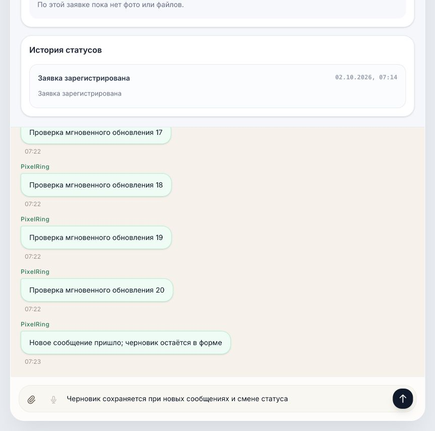

# Ускорение личного кабинета — реализация и проверка

Дата: 2026-10-02. Статус: код реализован и проверен локально; владелец разрешил фиксацию, слияние и выпуск. Проверка новой рабочей версии предстоит.

## База и границы работы

Работа выполнена в отдельной ветке `codex/portal-performance` поверх `1a27b6b33cd07146589104aa4b5ac6b8c61f165a`. Сверка через службу размещения подтверждает: это версия рабочего сайта после запроса на слияние №87; развёртывание `dpl_3N9BVfGLtC2T1TCoh6ZUzfMuATBd` имеет состояние готовности. При совмещении сохранены актуальные уведомления оператору, блокировки заявки, подтверждения прочтения и управление ИИ.

Область реализации — кабинет клиента и связанные чтения, отправка сообщений и уведомления об изменении данных. Основная рабочая папка владельца не редактировалась. Для ускорения не добавлены миграции или зависимости. Все проверки с записью выполнялись в одноразовой локальной базе; почта и ИИ заменены локальными сервисами. Проверка реального канала использовала синтетический аккаунт и пустые сигналы, без содержимого заявки и без каналов сотрудников.

## Проверка плана перед реализацией

План соответствует найденным в исходном коде причинам задержек:

1. Список кабинета извлекал все доступные заявки вместе с переписками, вложениями и историей. Открытие одной заявки повторно собирало данные всех заявок аккаунта.
2. Периодическое обновление всей страницы повторяло серверные чтения и затрагивало состояние интерфейса. У отдельных блоков были собственные опросы; несколько потребителей уведомлений могли запрашивать одинаковые данные.
3. Подтверждение отправки сообщения ожидало ответ ИИ. Ошибка после сохранения могла приводить к удалению уже привязанных файлов.
4. Видимые ссылки запускали предварительную загрузку многих страниц заявок; повторные проверки сеанса записывали время активности слишком часто.

В план внесены конкретные уточнения:

- Подтверждение сохранения отделено от завершения ИИ; совместимость прежнего ответа JSON (формата структурированных данных) сохранена.
- После подтверждённой записи файл не удаляется при ошибке ИИ, уведомлений или отключении клиента. Одна операция продолжается через `after()` (продолжение серверной работы после ответа), без второй попытки ИИ.
- Ручная повторная отправка после неопределённого сетевого результата использует тот же UUID (уникальный идентификатор сообщения). Проверка принадлежности выполняется заново; другой аккаунт не может получить чужой результат или заменить тело сообщения.
- Заглушка загрузки ограничена страницами кабинета и заявки. Общая заглушка на весь маршрут меняла код перенаправления прежних ссылок отчёта с 307 на 200; этот вариант исключён и совместимость перепроверена.
- Размещение вычислений не менялось: регион рабочей базы и влияние настоящих холодных запусков требуют отдельного подтверждения. Расположение локально настроенной базы не является доказательством расположения рабочей базы.
- Новая версия уведомлений оператору совмещена с ускорением до итоговых проверок. Повтор сообщения не увеличивает версию непрочитанной серии.

## Реализовано

### Ограниченные чтения

- Список: по 20 заявок на страницу, на обзоре показываются пять последних; счётчики вычисляются для всего доступного аккаунту набора. Фильтры активных заявок и опубликованных отчётов применяются в базе.
- Список не содержит переписок, вложений или истории статусов. Заголовок берётся из первого подходящего клиентского сообщения отдельным ограниченным запросом; служебные ссылки доступа исключаются.
- Открытие заявки читает одну доступную заявку, а переписка — последние 50 видимых сообщений. Более ранние сообщения загружаются по проверенному курсору внутри этой заявки. После возвращения из скрытой вкладки сохраняется возможность догрузить пропущенную часть истории.
- Независимые запросы выполняются параллельно после проверки доступа. Документы и уведомления сразу передаются из серверного первого отображения, без обязательного повторного чтения при запуске интерфейса.
- Первое отображение содержит до 50 текущих действий. Уведомления, материалы и завершённые задания читаются отдельными страницами по 50 записей; счётчики охватывают весь доступный набор. Старый элемент по прямой ссылке загружается отдельно с той же проверкой доступа. Проверена история из 1025 элементов, включая 900 завершённых заданий.
- Контекст сеанса переиспользуется только в рамках одного серверного отображения. Каждое обращение к данным повторно проверяет сеанс и доступ; время активности записывается не чаще одного раза за пять минут, включая конкурирующие чтения.

### Обновления и состояние интерфейса

- Один поставщик синхронизации на аккаунт объединяет обращения и уведомления. Сигналы изменения объединяются за 250 мс; событие во время чтения вызывает одно последующее актуальное чтение.
- Ably (сервис мгновенных сообщений) выдаёт подписку на один закрытый канал аккаунта на пять минут. В канал передаётся пустой сигнал. Клиент не получает разрешение на публикацию или доступ к каналам сотрудников.
- После окончательного сбоя создаётся новый клиент соединения; интервалы повторной попытки растут от 10 до 120 секунд. Страховочный режим включается только при подключённом соединении и подтверждённой подписке. Старые обработчики и поздние ответы закрытого аккаунта не влияют на новый клиент. При повторном открытии ранее скрытого блока выполняется одно свежее чтение.
- При подключённом канале страховочное чтение выполняется раз в 120 секунд. При недоступном канале переписка проверяется раз в 10 секунд, остальные активные блоки — раз в 30 секунд. Скрытая вкладка не опрашивает данные; возврат и восстановление соединения запускают сверку.
- Обновляются данные блоков без периодического обновления всей страницы. Черновик, выбранные файлы, положение переписки, фильтр и страница списка сохраняются. Возврат из заявки восстанавливает страницу и положение списка.
- Массовая предварительная загрузка ссылок отключена. Заявка предварительно загружается при наведении или фокусе с объединением повторов.
- Выход, отказ в доступе и смена аккаунта очищают приватные данные и отменяют применение запоздалых ответов предыдущего сеанса.

### Отправка сообщений

- Транзакция сохраняет сообщение и метаданные файлов; интерфейс получает подтверждение до ИИ и служебных уведомлений.
- ИИ использует ограниченный контекст последних сообщений. После подтверждения можно писать следующий черновик; следующая отправка ждёт завершения текущего ответа, чтобы сохранять порядок.
- Ошибка ИИ не превращает сохранённое сообщение в потерянное. Неопределённый сетевой исход сверяется с сервером; ручная повторная отправка не создаёт дубль и не вызывает ИИ повторно для уже записанного сообщения.
- Сохранены проверки действий клиента, вложений, частоты запросов, источника запроса и изоляции заявок. Уведомления оператору и изменение режима ИИ из версии №87 продолжают работать.

### Диагностика

Чтения возвращают `Server-Timing` (заголовок длительности авторизации и чтения данных) и `Cache-Control: private, no-store` (приватный ответ без кеширования). Журналы `portal.performance` (длительность обработчика) и `portal.data` (чтение базы и подготовка результата) содержат технические интервалы без текста сообщений, контактов, ключей или токенов.

## Результаты измерений

### Одинаковые функции чтения до и после

Для каждого сценария выполнены 20 повторов после первого вызова на одинаковых данных в локальной PostgreSQL (базе данных). Время включает запросы, подготовку результата и его сериализацию. Это измерение серверного пути, а не полного отображения браузера или рабочего сайта. Поле первого вызова в исходных измерениях не трактуется как настоящий холодный запуск.

| Заявок в аккаунте | Операция | До: время для 95% запросов | После: время для 95% запросов | До: байт результата | После: байт результата |
|---|---|---:|---:|---:|---:|
| 0 | Список | 3 мс | 1 мс | 592 | 677 |
| 3 | Список | 3 мс | 2 мс | 5 816 | 2 386 |
| 3 | Одна заявка | 2 мс | 2 мс | 14 799 | 10 220 |
| 100 | Список | 448 мс | 4 мс | 1 295 448 | 10 435 |
| 100 | Одна заявка | 262 мс | 3 мс | 2 642 207 | 35 111 |

Для 100 заявок объём списка сокращён на 99,2%, объём результата открытия заявки — на 98,7%. При трёх заявках небольшой исходный запрос уже был быстрым; главный эффект проявляется при росте истории и числа заявок. Время старой реализации заметно колебалось из-за большого объёма результата; все сохранённые цифры относятся к одной указанной локальной серии.

### Полный локальный HTTP (протокол веб-запросов)

По 20 повторов каждого чтения собранного приложения: список со 100 заявками — 5 мс для 95% запросов, открытие одной заявки — 4 мс. Размер ответов — 10 506 и 23 387 байт соответственно. Отличие от таблицы обусловлено другим составом ответов обработчика.

При искусственной задержке ИИ в 3,5 секунды подтверждение записи пришло за 8 мс. Сохранение проверено в базе до окончания ответа. После отмены потока сохранены сообщение и файл; ИИ завершился один раз.

### Настоящий канал мгновенных сообщений

В 20 повторах пустой сигнал через Ably (сервис мгновенных сообщений) вызывал завершённое чтение переписки браузером: для 95% событий — 445 мс, максимум — 541 мс. Интервал измеряется от начала публикации сигнала до завершения обработчика чтения, включая объединение событий; время отрисовки браузера отдельно не измерялось. Пришедшее сообщение и сохранённый черновик проверены в интерфейсе.

Модель общего планировщика в автоматической проверке даёт три страховочных чтения вместо консервативных 16 прежних чтений за 120 секунд для трёх активных ресурсов: снижение 81,25%. Это проверка алгоритма; количество запросов рабочего кабинета после выпуска ещё нужно измерить.

## Проверки

Все сценарии прошли без пропусков:

| Набор | Результат |
|---|---:|
| Синхронизация, поток сообщений, курсор истории, права канала | 15 из 15 |
| Основа кабинета | 28 из 28 |
| Уведомления оператору из текущей версии | 24 из 24 |
| Скорость и сетевые сценарии через локальное приложение | 10 из 10 |
| Защищённые документы | 7 из 7 |
| Уведомления и действия клиента | 6 из 6 |
| Фотоотчёты, статусы, печать и прежние ссылки | 24 из 24 |
| Вход и доступ к кабинету | 10 из 10 |
| Защита тестов от рабочей базы | 4 из 4 |
| Защита служебных маршрутов | 33 маршрута |

Всего 128 автоматических сценариев, дополнительно 33 проверки маршрутов. Пройдены проверка типов, проверка качества изменённого кода, промышленная сборка и проверка разницы файлов на ошибки пробелов. Шесть языков и арабское направление проверены в сквозных сценариях.

В браузере подтверждены: 50 активных заявок из 100; пять последних на обзоре; 20 строк списка; переход на страницу 2 из 5 и возврат на неё; догрузка ранней истории; новое сообщение и статус без сброса черновика; отсутствие ошибок интерфейса в консоли. Выбранное фото и черновик сохранялись при резервном опросе; файл после разрыва потока проверен отдельно сквозным сценарием.

- [Исходные измерения](performance_evidence_2026-10-02/measurements.json).
- [Черновик после мгновенного обновления](performance_evidence_2026-10-02/draft_after_live_update.png).
- [Черновик и фото после резервного опроса](performance_evidence_2026-10-02/draft_and_photo_after_fallback.jpg).

## Основные места реализации

| Назначение | Исходный код |
|---|---|
| Ограниченное чтение и история | [Модель чтения](../../signage-service/src/lib/portal/production-data.ts) |
| Общий механизм обновлений | [Поставщик данных](../../signage-service/src/components/portal/PortalLiveProvider.tsx), [планировщик](../../signage-service/src/lib/portal/sync.ts) |
| Список и сохранение положения | [Кабинет](../../signage-service/src/components/portal/PortalDashboard.tsx) |
| Переписка, черновик, повторная отправка | [Интерфейс переписки](../../signage-service/src/components/portal/PortalRequestChat.tsx) |
| Подтверждение до ИИ и совместимость | [Обработчик сообщений](../../signage-service/src/app/api/portal/requests/[publicRequestNumber]/messages/route.ts) |
| Сеанс и запись активности | [Авторизация](../../signage-service/src/lib/portal/auth.ts) |
| Повторяемые сценарии проверки | [Синхронизация и поток](../../signage-service/scripts/test-portal-performance.test.ts), [проверки приложения](../../signage-service/scripts/test-portal-performance-http.test.ts) |

## Что остаётся для рабочего сайта

Локальная реализация завершена. Снижение задержек рабочего сайта пока не подтверждено: эта ветка ещё не выпущена. Владелец отдельно подтвердил фиксацию изменений, создание запроса на слияние, добавление в основную ветку и публикацию 2026-10-02. Это подтверждение соответствует правилу сотрудничества в корневом `AGENTS.md` (инструкциях проекта).

Разрешённая последовательность выпуска:

1. Зафиксировать проверенную ветку, создать запрос на слияние и провести проверку изменений. Перед слиянием сверить актуальную основную ветку и сохранить новые изменения других задач.
2. Убедиться, что ключ Ably (сервиса мгновенных сообщений) рабочей среды разрешает подписку и публикацию закрытых каналов кабинета. Локальная проверка подтверждает работоспособность локально настроенного ключа; настройки рабочей среды проверяются отдельно.
3. Выпустить тот же проверенный код. Новая миграция для ускорения не требуется; схема существующего выпуска №87 сохранена.
4. Выполнить не менее 20 повторов на тестовом рабочем аккаунте: обзор, заявка, сообщение, обновление сотрудника, документы, отчёт, печать, возвращение к списку. Отдельно измерить первый запуск и повторные переходы, нагрузку сети, время чтения базы и время отображения браузера.
5. Подтвердить цели: реакция локальных кнопок до 200 мс; повторное открытие заявки до 1 секунды для 95% переходов; полезное отображение обзора до 1,5 секунды; подтверждение сообщения до 1 секунды независимо от ИИ; обновление сотрудника до 3 секунд при подключённом канале; снижение фоновых запросов минимум на 70%.
6. Проверить на рабочей версии отключение сети, возвращение из скрытой вкладки, истечение сеанса, отзыв доступа и смену аккаунта. Если цели не достигнуты, разбирать оставшийся вклад сетевой задержки, размещения вычислений и базы, холодного запуска и размера браузерных ресурсов по отдельности.

Ограничения: резервный опрос без мгновенного канала даёт задержку до 10 секунд для переписки и до 30 секунд для остальных блоков. Продолжение ИИ проверено при отключении клиента, но не является постоянной очередью восстановления после аварийной остановки серверного процесса. Регион рабочей среды и настоящие холодные запуски не оценены этим локальным замером.

## Progress Log (журнал прогресса)

### 2026-10-02 — реализация и итоговая проверка

- Текущий блок: ускорение кабинета поверх рабочего выпуска №87.
- Сделано: проверен и уточнён план, ограничены чтения списка и истории, объединены обновления, добавлен закрытый канал, сохранено состояние интерфейса, отделено подтверждение сообщения от ИИ, защищены файлы и повторная отправка. Пройдены 128 сценариев, 33 проверки служебных маршрутов, типы, качество кода, промышленная сборка и проверки браузера. Сохранены измерения и подтверждения интерфейса.
- В процессе: разрешённый владельцем выпуск.
- Следующее действие: создать запрос на слияние, дождаться проверки сборки, выпустить проверенный код и подтвердить цели на тестовом рабочем аккаунте.
- Блокеры/риски: рабочая скорость ещё не измерена после оптимизации; регион и холодный запуск требуют проверки. Без мгновенного канала действует резервный опрос; аварийная остановка процесса не восстанавливает ИИ через отдельную очередь.
- Обновлённые документы: этот отчёт, указатели кабинета и служебной системы, основной план кабинета, сверенный статус уведомлений оператору, карта состояния проекта и глобальный журнал.

### 2026-10-02 — разрешённый выпуск

- Текущий блок: фиксация и публикация проверенного пакета.
- Сделано: владелец разрешил добавление в основную ветку и выпуск; повторно подтверждены актуальность базы ветки и отсутствие изменений схемы.
- В процессе: запрос на слияние и проверка развёртывания.
- Следующее действие: после готовности сборки слить пакет и проверить рабочую версию.
- Блокеры/риски: фактические задержки рабочего кабинета ещё не измерены после публикации.
- Обновлённые документы: этот журнал и глобальный журнал.

### 2026-10-02 — замечания проверки перед слиянием

- Текущий блок: исправления проверки запроса на слияние №88.
- Сделано: устранены оба замечания автоматической проверки исходной фиксации `99a14ed` (идентификатора версии): неограниченная история в первом отображении и отсутствие восстановления после окончательного сбоя соединения. Дополнительно исправлена устаревшая копия данных при повторном открытии блока. Проверены пагинация 1025 элементов, полные счётчики, старые ссылки, отзыв доступа и повторное подключение. Итог: 128 сценариев и прежние 33 проверки служебных маршрутов; типы, качество кода и сборка проходят.
- Сделано в браузере: 125 завершённых заданий открываются страницами 50/50/25, кнопки перехода работают, старое задание по прямой ссылке отображается вместе с полем ответа.
- В процессе: обновление запроса на слияние и ожидание предварительной сборки.
- Следующее действие: дождаться готовности предварительной сборки, слить пакет и проверить рабочую версию.
- Блокеры/риски: прежняя сессия рабочего тестового аккаунта недоступна; владельцу предложено войти во встроенном браузере. Публикация продолжается, но замер авторизованного рабочего кабинета зависит от входа.
- Обновлённые документы: этот отчёт.
